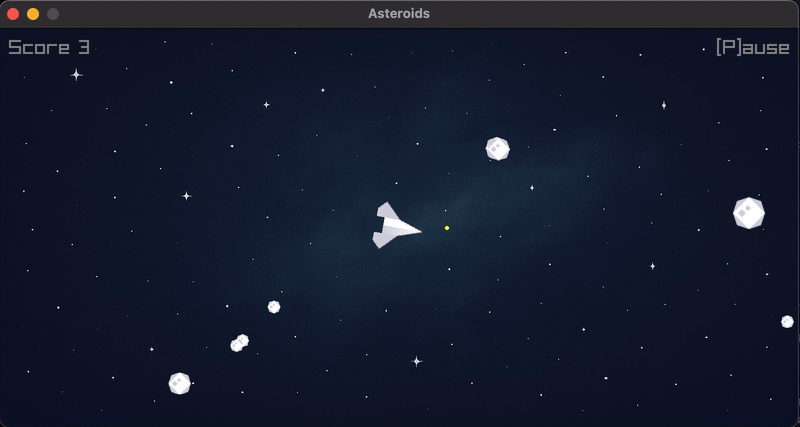

# Asteroids - Go Implementation



A Go implementation of the classic Asteroids arcade game using Raylib-go for graphics rendering. This space shooter game features a player-controlled spaceship that must destroy asteroids while avoiding collisions in a wrap-around screen environment.

This project is associated with a blog post (LINK to follow) that walks through the implementation details.

## Game Features

- Player spaceship with rotation and thrust controls
- Shooting mechanics with limited ammunition
- Asteroid collision detection and destruction
- Screen wrapping for seamless movement
- Victory condition when all asteroids are destroyed
- Game over on collision with asteroids

## Controls

- Arrow keys: Rotate and thrust the spaceship
- Spacebar: Fire shots
- P: Pause/unpause the game
- R: Restart after game over

## Running the Code

```bash
make
```

This implementation demonstrates classic 2D game physics, collision detection, and real-time rendering using Go and Raylib.
