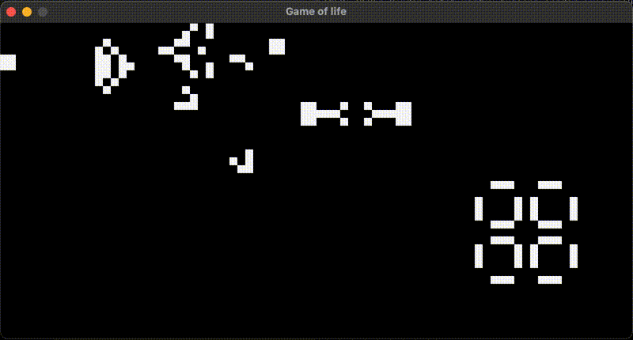

# Conway's Game of Life - Go Implementation



A Go implementation of Conway's Game of Life using Raylib-go for graphics rendering. This cellular automaton was devised by mathematician John Horton Conway and demonstrates how complex patterns can emerge from simple rules.

This project is associated with a blog post (LINK to follow) that walks through the implementation details.

## Rules

The game follows four simple rules:
1. Any live cell with fewer than two live neighbors dies (underpopulation)
2. Any live cell with two or three live neighbors survives
3. Any live cell with more than three live neighbors dies (overpopulation)
4. Any dead cell with exactly three live neighbors becomes alive (reproduction)

## Running the Code

```bash
make
```

This implementation uses Raylib-go to create a visual simulation that demonstrates the fascinating emergent patterns that arise from these simple rules.
