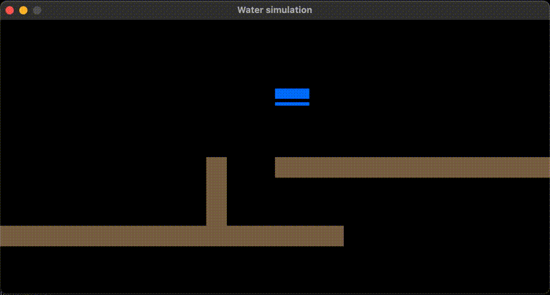

# Water Simulation - Go Implementation



A Go implementation of a 2D water simulation using Raylib-go for graphics rendering. This physics simulation demonstrates fluid dynamics with water droplets that flow, settle, and interact with obstacles in a realistic manner.

This project is associated with a blog post (LINK to follow) that walks through the implementation details.

## Simulation Features

- Realistic water flow physics with gravity
- Water volume conservation and transfer mechanics
- Obstacle collision and water pooling
- Visual water level representation
- Automated water generation and continuous flow
- Pre-defined obstacle courses for water interaction

## Controls

This is an automated simulation - simply run the program to watch water flow through the obstacle course. No user interaction is required.

## Running the Code

```bash
make
```

This implementation demonstrates 2D fluid simulation, cellular automata principles, and real-time physics rendering using Go and Raylib.
